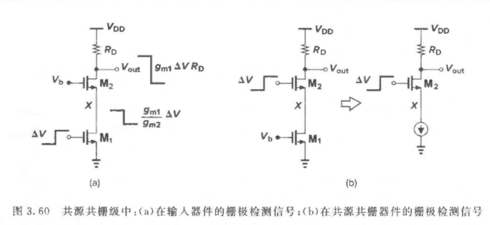
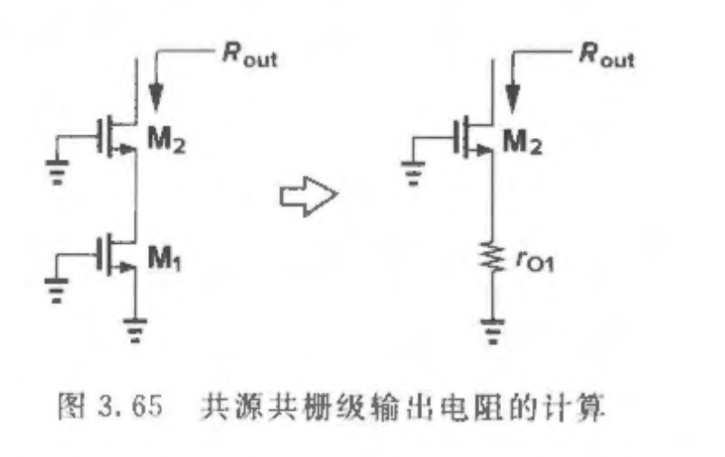
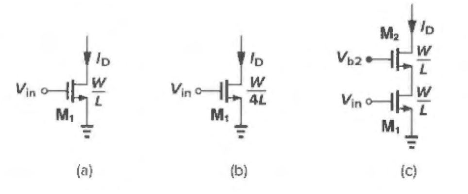
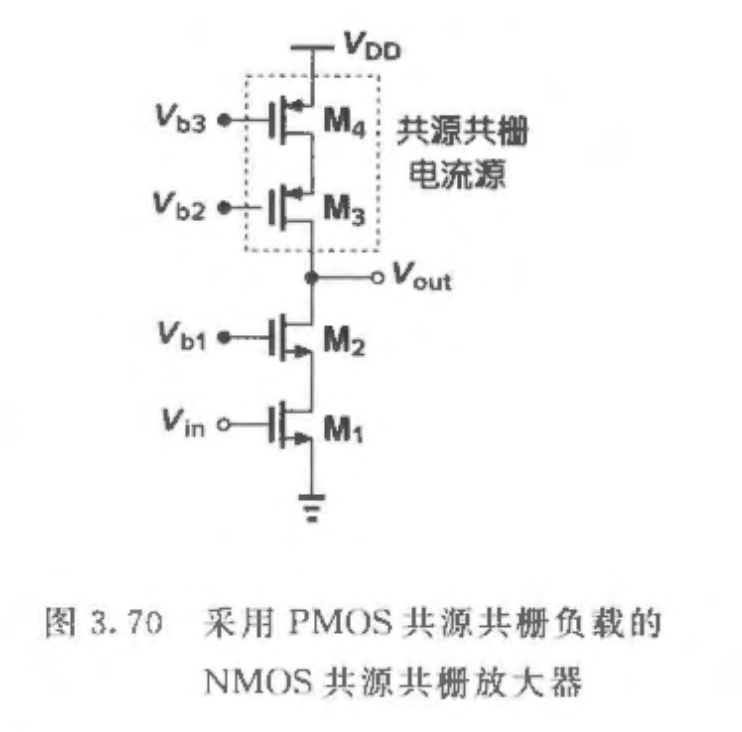

# Analog_IC

### 3.6 共源共栅级

共源级和共栅级的级联叫作共源共栅cascode结构

$$
R_{out} = \left[1 + \left(g_{m2} + g_{mb2}\right)r_{o2}\right]r_{o1} + r_{o2}
$$

有时候共源共栅级可以扩展为三个或更多器件的层叠以获得更高的输出阻抗，但是所需要的额外的电压余度使这样的结构缺少吸引力; 例如，三层共源共栅电路的最小输出电压等于三个过驱动电压之和。

$$
V_{out} \geq V_{in} - V_{TH1} + V_{GS2} - V_{TH2}
$$

$$
= \left(V_{GS1} - V_{TH1}\right) + \left(V_{GS2} - V_{TH2}\right)
$$

$$
= V_{ov1} + V_{ov2}
$$

在给定的偏置电流的条件下，比较两种提高输出阻抗的方法也很有意义：

- cascode 结构用共源共栅（在相同偏置电流、相同电压余量约束下， 用 cascode 提高输出阻抗通常比单纯加长输入管L 更有效。）

- 把输入管 M1 的沟道长度 L 加大

例如，假设共源级输人管的长度变为原来的四倍而宽度保持不变. 因为
$$
I_D = \frac{1}{2}\mu_n C_{ox}\frac{W}{L}\left(V_{GS}-V_{TH}\right)^2
$$

$$
I_D = \frac{1}{2}\mu_n C_{ox}\frac{W}{L}V_{ov}^2
$$

（b）中Vov变成2倍，和（c）的Vov相等，即电路受到相同的电压摆幅约束。

而且 $\lambda \propto \frac{1}{L}$，所以 $L$ 增大到 4 倍的结果只是使 $g_m r_o$ 的值增大到 2 倍，然而共源共栅结构却使输出阻抗大约增大为 $g_m r_o^2$。对于给定的电压余度，cascode提供更高的输出阻抗。

可以做恒定电流源

高的输出附抗提供一个接近理想的电流源，但这样做的代价是牺牲了电压余度
